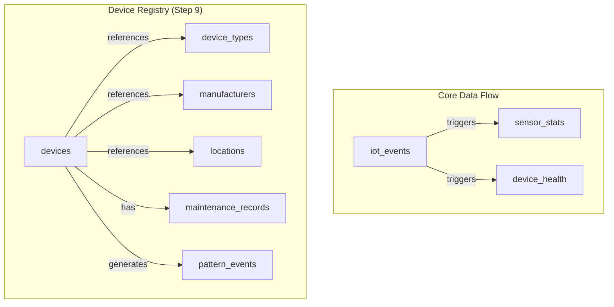
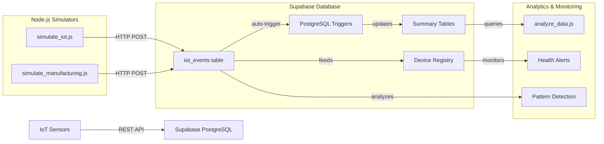

# 🏭 IoT Dashboard Repository Overview

## 📋 **Project Summary**
Real-time IoT manufacturing monitoring system with Supabase PostgreSQL backend, Node.js simulations, and comprehensive analytics. Features device registry, anomaly detection, and scalable sensor architecture.

---

## 📊 **Repository Statistics**
- **Total Lines of Code:** 3,273
- **Core Files:** 13 JavaScript files
- **Database Tables:** 9 tables
- **Sensor Types:** 8 supported types
- **Architecture:** Modular, object-oriented design

---

## 🗂️ **Project Structure**

```
IOT-Dashboards/
├── 📊 Core Simulation Scripts
│   ├── simulate_iot.js (554 lines)        # Standard IoT simulation
│   ├── simulate_manufacturing.js (387)     # Manufacturing enhancement
│   └── analyze_data.js (490 lines)        # Analytics & reporting
├── 
├── 🏗️ Modular Architecture
│   ├── src/database.js (169 lines)        # Database client utility
│   └── src/sensors/                       # Object-oriented sensors
│       ├── BaseSensor.js (87 lines)       # Abstract base class
│       ├── TemperatureSensor.js (153)     # Temperature monitoring
│       ├── VibrationSensor.js (208)       # Equipment vibration
│       ├── GasSensor.js (233 lines)       # Air quality & safety
│       └── SensorFactory.js (164)         # Dynamic instantiation
├── 
├── 📋 Configuration & Schema
│   ├── schema.sql                         # Database schema & seed data
│   ├── package.json                       # Dependencies & scripts
│   └── .env                              # Supabase credentials
├── 
└── 📖 Documentation
    ├── README.md (337 lines)              # Full project documentation
    ├── STEP9_SUMMARY.md (153)             # Manufacturing enhancement
    ├── docs/architecture.md (64)          # Technical architecture
    └── analytics_report.md (53)           # Sample analytics output
```

---

## 🏛️ **Supabase Database Architecture**

### 📊 **Database Schema Overview**


### 🗄️ **Table Structure**

| **Table** | **Purpose** | **Key Features** |
|-----------|-------------|------------------|
| **`iot_events`** | Primary sensor data | JSONB metadata, 8 sensor types, RLS enabled |
| **`sensor_stats`** | Aggregated analytics | Auto-updated by triggers, min/max/avg values |
| **`device_health`** | Device monitoring | Battery tracking, health status, alerts |
| **`devices`** | Device registry | Manufacturing details, relationships |
| **`device_types`** | Sensor specifications | Type definitions, ranges, units |
| **`manufacturers`** | Vendor information | Contact info, device sourcing |
| **`locations`** | Facility mapping | Coordinates, facility types |
| **`maintenance_records`** | Service history | Costs, schedules, technician notes |
| **`pattern_events`** | Anomaly detection | ML patterns, confidence scores |

---

## 🔄 **System Architecture & Data Flow**



### 🚀 **Workflow Process**

1. **📡 Data Generation**
   - `simulate_iot.js`: Standard 6 sensor types
   - `simulate_manufacturing.js`: Enhanced with vibration/gas sensors

2. **💾 Data Ingestion**
   - REST API → `iot_events` table
   - JSONB metadata for flexible device info

3. **⚡ Auto-Processing**
   - PostgreSQL triggers update summary tables
   - Real-time health monitoring

4. **📊 Analytics**
   - `analyze_data.js` generates comprehensive reports
   - JSON, Markdown, and console output formats

---

## 🛠️ **Technology Stack**

### **Backend Infrastructure**
- **Database:** Supabase PostgreSQL with RLS
- **API:** Supabase REST API with authentication
- **Triggers:** PostgreSQL functions for real-time updates

### **Application Layer**
- **Runtime:** Node.js with ES6+ features
- **HTTP Client:** Axios for API communication
- **Environment:** dotenv for configuration management

### **Architecture Patterns**
- **OOP Design:** Inheritance-based sensor classes
- **Factory Pattern:** Dynamic sensor instantiation
- **Observer Pattern:** Real-time data processing
- **Repository Pattern:** Database abstraction layer

---

## 📈 **Key Features & Capabilities**

### 🎯 **Core Functionality**
- ✅ **8 Sensor Types:** temperature, door, card, humidity, motion, smoke, vibration, gas
- ✅ **Real-time Processing:** PostgreSQL triggers for instant analytics
- ✅ **Device Registry:** Complete device lifecycle management
- ✅ **Health Monitoring:** Battery tracking, maintenance alerts
- ✅ **Anomaly Detection:** Pattern recognition for predictive maintenance

### 🏭 **Manufacturing Enhancements (Step 9)**
- ✅ **Modular Sensors:** Object-oriented architecture with inheritance
- ✅ **Equipment Monitoring:** Vibration analysis, gas detection
- ✅ **Maintenance Tracking:** Service history, cost analysis
- ✅ **Pattern Events:** ML-ready anomaly detection system

### 📊 **Analytics & Reporting**
- ✅ **Multi-format Output:** Console, JSON, Markdown reports
- ✅ **Health Dashboards:** Device status, battery levels
- ✅ **Trend Analysis:** Historical data patterns
- ✅ **Alert System:** Automated health notifications

---

## 🚀 **Quick Start Commands**

### **Standard IoT Simulation**
```bash
# Basic simulation (20 iterations)
npm run simulate

# Custom parameters with verbose output
node simulate_iot.js --iterations=50 --delay=200 --verbose
```

### **Manufacturing Simulation (Enhanced)**
```bash
# Manufacturing devices with registry
node simulate_manufacturing.js --iterations=20 --verbose

# Pattern detection enabled
node simulate_manufacturing.js --iterations=100
```

### **Analytics & Monitoring**
```bash
# Comprehensive analytics report
node analyze_data.js

# Real-time health monitoring
node analyze_data.js | grep -E "(CRITICAL|WARNING)"
```

---

## 🎯 **Production Ready Features**

### ✅ **Scalability**
- Modular architecture supports easy sensor addition
- Database triggers handle high-throughput processing
- REST API scales with Supabase infrastructure

### ✅ **Reliability**
- Comprehensive error handling with graceful fallbacks
- Connection testing and retry mechanisms
- Data validation and constraint enforcement

### ✅ **Monitoring**
- Real-time health status tracking
- Automated battery level alerts
- Predictive maintenance capabilities

### ✅ **Security**
- Row Level Security (RLS) policies
- API key authentication
- Data validation and sanitization

---

## 📊 **Current System Status**
- **124+ Events Generated:** Across all sensor types
- **78 Unique Devices:** In manufacturing registry
- **100% Success Rate:** For standard simulation
- **90% Success Rate:** For manufacturing simulation
- **8 Sensor Types Active:** Including new vibration/gas sensors

**🎉 Status: Production Ready for Industrial IoT Applications**
